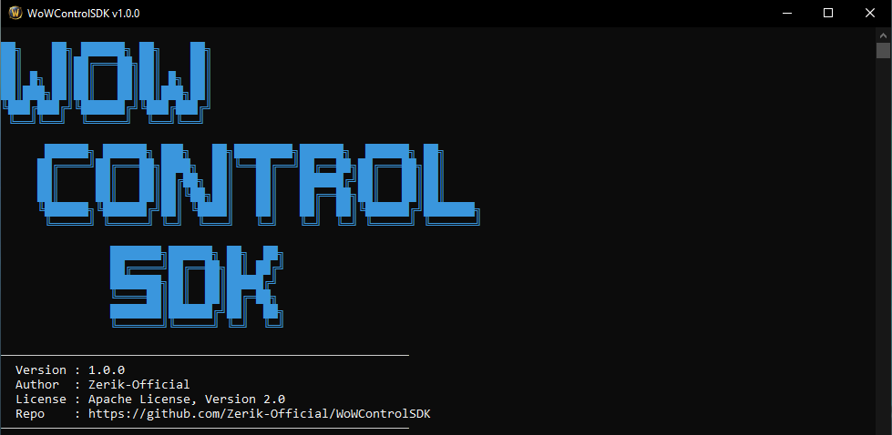

<h1 align="center">WoWControlSDK</h1>

<p align="center">
  
  
  
  
</p>

<p align="center">
  
  
  
  
</p>

<p align="center">
  
</p>

<p align="center">
  <a href="README.md">View in English</a>
</p>

> [!CAUTION]
> Este SDK **no** está enfocado en hacking, trampas o bots. Es una herramienta para integración legítima — launchers, overlays de stream, Discord rich presence, automatización de interfaz, y usos similares. **Recuerda jugar siempre de manera honesta.** El autor no se hace responsable por suspensiones de cuenta o baneos resultantes del mal uso de este software.

SDK liviano inyectable que expone los internos de **World of Warcraft 3.3.5a** a través de una interfaz **JSON-RPC 2.0** limpia sobre Named Pipes de Windows. Comunicate con WoW desde **cualquier lenguaje** — Python, JavaScript, C#, Rust — enviando comandos JSON a `\\.\pipe\WowGameCommand`.

Este proyecto nace de la necesidad de extraer información en tiempo real de WoW (pantalla actual, datos del personaje, estado del mapa, etc.) para un próximo launcher — aunque quizás con demasiadas funcionalidades para lo que realmente necesito para un RichPresence. La API Lua de WoW es muy limitante: nada de peticiones HTTP, nada de lectura de archivos en tiempo real, no puedes comunicarte con el exterior. La idea se inspiró en [wow-discord-rpc](https://github.com/AipNooBest/wow-discord-rpc), un proyecto genial y muy ingenioso que codifica datos en píxeles y los lee desde la pantalla para alimentar el Rich Presence de Discord — fue lo que me inspiró a crear este SDK. WoWControlSDK toma un enfoque más directo: una DLL inyectable liviana con una interfaz RPC limpia.

Esta es aún una versión temprana y verde. Con el tiempo y a medida que tenga más tiempo libre, iré añadiendo nuevas funcionalidades, eventos, comandos y mejoras — sobre todo a la arquitectura, que fue creciendo con el tiempo y siento que ahora mismo es algo rara.

---

## Documentación

La documentación está en progreso. Con el tiempo, los docs detallados estarán en la carpeta `docs/`, cubriendo arquitectura, escritura de handlers RPC personalizados, extensión de la API, y más.

## Funcionalidades

- **Ejecución Lua** — Ejecuta Lua arbitrario en el VM de WoW (`lua.evaluate` con retorno tipado, `lua.execute` fire-and-forget)
- **Globales Lua** — Lee/escribe variables globales, crea namespaces de tablas
- **Consultas de unidades** — Obtén salud, poder, posición, rotación, raza, clase, nivel, GUID, target, nombre, auras (fantasma, muerte, combate, lanzando, etc.) para `player`, `target`, `focus`, `mouseover`, `partyN`, `raidN`
- **Grupo/Raid** — Lista de miembros, resumen de combate, GUID del líder, cacheado por rendimiento
- **Estado del mundo** — ¿Está en mundo?, ¿en combate?, ID de zona/mapa
- **Jugador local** — XP, XP máximo, AFK, DND, bajo agua, detección de fantasma
- **Thread-Safe** — Operaciones Lua usan `lua_pcall` con `errfunc=0` (seguro desde el pipe thread)
- **Autenticación** — Inicia sesión en WoW con usuario/contraseña, selecciona reino, entra al mundo, cierra sesión, sal del juego
- **Aceptación EULA/TOS** — Automatiza la aceptación de licencias y términos de servicio
- **Lista de reinos** — Consulta y establece listas de reinos personalizadas
- **Detección de pantalla** — Detecta la pantalla actual del juego (login, selección de personaje, carga, mundo, etc.)
- **Gestión de personajes** — Lista y refresca los personajes del reino
- **Sistema de eventos** — Suscríbete a eventos del juego (cambios de pantalla, estado del mundo) recibidos en tiempo real por el pipe

## Arquitectura

```
┌─────────────┐     JSON-RPC 2.0      ┌──────────────────┐
│  Tu App     │ ◄──── named pipe ──── │  WoWControlSDK   │
│ (Python/JS/  │     \\.\pipe\         │  (DLL inyectada)  │
│  C#/etc.)   │   WowGameCommand      │                   │
└─────────────┘                       └────────┬─────────┘
                                               │
                                    ┌──────────┴──────────┐
                                    │  World of Warcraft   │
                                    │    3.3.5a cliente    │
                                    └─────────────────────┘
```

Todo el acceso a memoria del juego está aislado en la capa `core/`. La capa `rpc/` solo maneja serialización JSON — ni direcciones crudas ni lecturas de memoria.

## Dependencias

| Dependencia | Versión | Propósito |
|---|---|---|
| [Microsoft Detours](https://github.com/microsoft/Detours) | v4.0.1 | Hooking de APIs (inyección DLL, detours de funciones) |
| Windows SDK | 10.0+ | Named Pipes, gestión de procesos |
| CMake | 3.20+ | Sistema de compilación |
| Visual Studio | 2022 | Compilador C++17 |

## Compilación

### Requisitos
- Visual Studio 2022 con la carga de trabajo "Desarrollo de escritorio con C++"
- CMake 3.20+

### Pasos

```bash
git clone https://github.com/Zerik-Official/WoWControlSDK.git
cd WoWControlSDK

cmake -B build
cmake --build build --config Release
```

Salida:
- `bin/release/WoWControlSDK.dll` — El SDK inyectable
- `bin/release/WowInjector.exe` — El inyector

## Uso

### Inyector

```bash
WowInjector.exe --wow "C:\World of Warcraft\Wow.exe" --dll "bin\release\WoWControlSDK.dll"
```

> [!TIP]
> El inyector incluido es recomendado — congela el proceso Wow.exe durante la inyección para que la DLL esté completamente inicializada antes de que el juego arranque. Sin embargo, puedes usar cualquier inyector de tu preferencia, como [Cheat Engine](https://www.cheatengine.org/).

**Parámetros:**

| Argumento | Descripción |
|---|---|
| `--wow <path>` | Ruta a `Wow.exe` |
| `--dll <path>` | Ruta a `WoWControlSDK.dll` |
| `--pipe <name>` | Pipe named a esperar antes de descongelar (por defecto: `WowGameCommand`) |
| `--no-pipe` | Descongela después de `--wait` ms en vez de esperar el pipe |
| `--wait <ms>` | Milisegundos a esperar cuando `--no-pipe` está activo (por defecto: 500) |
| `--kill` | Mata el proceso de WoW existente antes de lanzar |
| `--wow-args <str>` | Argumentos extra para WoW.exe |
| `--pipe-cmd <json>` | Envía un comando JSON-RPC después de que el pipe esté listo (repetible) |

### Herramienta CLI de prueba

Un CLI interactivo en Python está disponible en `tests/wowsdk_cli.py` con menús para ejecución Lua, consultas de unidades, inspección de grupo y más. Úsalo como referencia o punto de partida para tu propia integración.

**Dependencias:**

```bash
pip install pywin32
```

**Uso:**

```bash
python tests/wowsdk_cli.py
```

### Protocolo RPC

Envía peticiones JSON-RPC 2.0 al named pipe `\\.\pipe\WowGameCommand`:

```json
{"jsonrpc": "2.0", "id": 1, "method": "unit.get", "params": {"token": "player"}}
```

**Respuesta:**
```json
{"id": 1, "jsonrpc": "2.0", "result": {"exists": true, "health": 25000, "maxHealth": 25000, "name": "PlayerName", "position": {"x": 1234.5, "y": 2345.6, "z": 300.1}, "rotation": 5.23, "dead": false, "ghost": false, ...}}
```

**Desde cualquier lenguaje:**

<details>
<summary>Python</summary>

```python
import win32pipe, win32file, json

pipe = win32file.CreateFile(
    r"\\.\pipe\WowGameCommand",
    win32file.GENERIC_READ | win32file.GENERIC_WRITE,
    0, None, win32file.OPEN_EXISTING, 0, None
)

def rpc(method, params={}):
    req = json.dumps({"jsonrpc": "2.0", "id": 1, "method": method, "params": params})
    win32file.WriteFile(pipe, (req + "\n").encode())
    _, data = win32file.ReadFile(pipe, 65536)
    return json.loads(data.decode())

print(rpc("unit.get", {"token": "player"}))
```
</details>

<details>
<summary>C#</summary>

```csharp
using System.IO.Pipes;

var pipe = new NamedPipeClientStream(".", "WowGameCommand", PipeDirection.InOut);
pipe.Connect();
var writer = new StreamWriter(pipe) { AutoFlush = true };
var reader = new StreamReader(pipe);

writer.WriteLine("{\"jsonrpc\":\"2.0\",\"id\":1,\"method\":\"lua.evaluate\",\"params\":{\"code\":\"return UnitName(\\\"player\\\")\"}}");
var response = reader.ReadLine();
Console.WriteLine(response);
```
</details>

### Métodos RPC principales

> Hay muchos más métodos disponibles. Estos son los más usados.

| Método | Descripción |
|---|---|
| `lua.execute` | Ejecuta Lua (fire-and-forget) |
| `lua.evaluate` | Ejecuta Lua con retorno tipado |
| `lua.getGlobal` / `lua.setGlobal` / `lua.createNamespace` | Operaciones de globales Lua |
| `unit.get` / `unit.state` / `unit.position` | Consultas de datos de unidad |
| `unit.mapPosition` | Posición normalizada en el mapa **(solo party/raid)** |
| `group.get` / `group.summary` | Información de grupo/raid |
| `client.login` / `client.enterWorld` / `client.logout` / `client.quit` | Autenticación y control de sesión |
| `client.getScreen` / `client.getDebugState` | Detección de pantalla y estado debug |
| `client.getRealmlist` / `client.setRealmlist` | Gestión de lista de reinos |
| `client.getCharacters` / `client.refreshCharacters` | Lista de personajes |
| `client.acceptAll` / `client.acceptEULA` / `client.acceptTOS` | Automatización EULA/TOS |
| `client.ping` | Health check de conexión |
| `world.getState` | Estado del mundo/zona |
| `object.exists` / `object.getType` / `object.isUnit` / `object.isPlayer` | Inspección de objetos |
| `events.subscribe` / `events.unsubscribe` / `events.list` | Sistema de eventos — soporta eventos nativos de Lua (PLAYER_LOGIN, PLAYER_ENTERING_WORLD, etc.) |
| `dll.toggleConsole` / `dll.getInfo` / `dll.getLogs` / `dll.setLogConfig` | Gestión de la DLL |

> [!WARNING]
> Solo se soporta **WoW 3.3.5a (build 12340)**. Se recomienda un cliente limpio y sin modificaciones, aunque es posible que funcione en uno ligeramente modificado.

## Feedback

¿Encontraste un error? ¿Tienes una sugerencia? Abre un [issue](https://github.com/Zerik-Official/WoWControlSDK/issues) en GitHub.

## Licencia

[Apache License 2.0](LICENSE)
